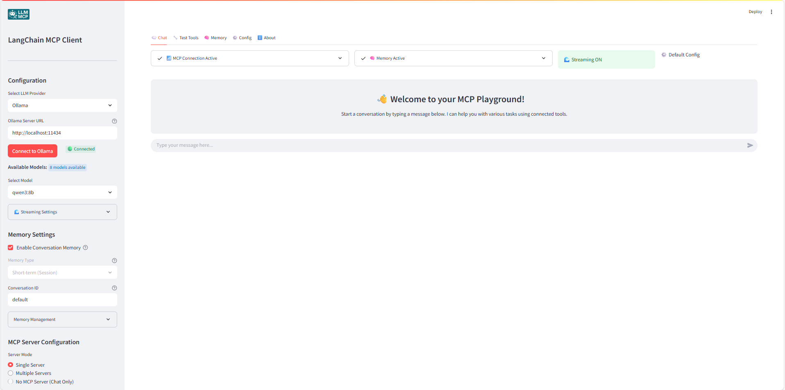
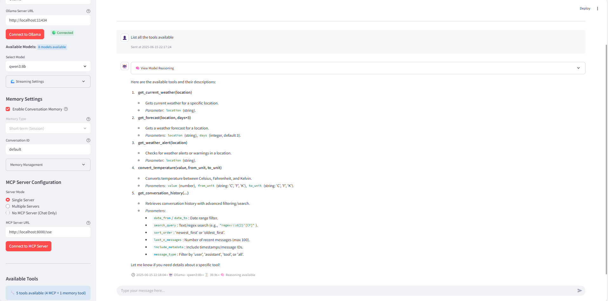

# LangChain MCP Client Streamlit App

This Streamlit application provides a user interface for connecting to MCP (Model Context Protocol) servers and interacting with them using different LLM providers (OpenAI, Anthropic, Google, Ollama).



## ⚠️ Development Status

**This application is currently in active development.** While functional, you may encounter bugs, incomplete features, or unexpected behavior. We appreciate your patience and welcome feedback to help improve the application.

## Features

- **Multi-Provider LLM Support**: OpenAI, Anthropic Claude, Google Gemini, and Ollama
- **OpenAI Reasoning Models Support**: Enhanced support for o3-mini, o4-mini with specialized parameter handling
- **Streaming Responses**: Real-time token-by-token streaming for supported models
- **MCP (Model Context Protocol) Integration**: Connect to MCP servers for tool access
- **Advanced Memory Management**: Short-term session memory and persistent cross-session memory
- **Multi-Server Support**: Connect to multiple MCP servers simultaneously
- **Tool Testing Interface**: Test individual tools with custom parameters
- **Chat-Only Mode**: Use without MCP servers for simple conversations
- **Advanced Model Configuration**: Custom temperature, max tokens, timeout, and system prompts
- **Intelligent Model Validation**: Automatic parameter validation and compatibility checking
- **Comprehensive Logging**: Track all tool executions and conversations
- **Export/Import**: Save and load conversation history
- **Containerized Deployment**: Easy Docker setup



## NEW - Streaming Support

The application now supports real-time streaming responses for all compatible models:

### Supported Models with Streaming
- ✅ **OpenAI**: All GPT models (GPT-4o, GPT-4, GPT-3.5-turbo) + Reasoning models (o3-mini, o4-mini)
- ✅ **Anthropic**: All Claude models (Claude-3.5-Sonnet, Claude-3-Opus, Claude-3-Haiku)
- ✅ **Google**: All Gemini models (Gemini-2.0-Flash, Gemini-2.5-Pro-Exp)
- ✅ **Ollama**: All local models (Granite, Qwen, etc.)
- ❌ **OpenAI o1 Series**: o1, o1-mini, o1-preview (not supported due to API limitations)

### How It Works
1. **Enable Streaming**: Toggle in the "🌊 Streaming Settings" section in the sidebar
2. **Real-time Display**: Responses appear token by token as they're generated
3. **Tool Integration**: See tool execution status in real-time
4. **Fallback Support**: Automatically falls back to non-streaming if issues occur

### Benefits
- **Better User Experience**: See responses as they're being generated
- **Faster Perceived Response Time**: Start reading while the model is still generating
- **Real-time Feedback**: Know immediately when tools are being executed
- **Interactive Feel**: More engaging conversation experience

## OpenAI Reasoning Models Support

The application now includes enhanced support for OpenAI's reasoning models with specialized handling:

### Supported Reasoning Models
- ✅ **o3-mini**: Fast reasoning model with streaming support
- ✅ **o4-mini**: Advanced reasoning model with streaming support
- ❌ **o1 Series**: o1, o1-mini, o1-preview (not supported due to unique API requirements)

### Reasoning Model Features
- **Automatic Parameter Optimization**: Uses `max_completion_tokens` instead of `max_tokens`
- **Temperature Handling**: Automatically disables temperature for reasoning models (they use fixed temperature)
- **Reasoning Effort**: Automatically sets reasoning effort to "medium" for optimal performance
- **Streaming Support**: o3/o4 series support real-time streaming (o1 series does not)
- **Smart Validation**: Prevents incompatible parameter combinations with clear error messages

### User Experience
- **Clear Warnings**: Visual indicators when selecting reasoning models
- **Alternative Suggestions**: Recommends compatible models when o1 series is selected
- **Seamless Integration**: Works with all existing features (memory, tools, streaming)

## Configuration System

### LLM Providers & Parameters
- **OpenAI**: 
  - **Regular Models**: GPT-4o, GPT-4, GPT-3.5-turbo with temperature (0.0-2.0), max tokens (1-16384), timeout (10-600s)
  - **Reasoning Models**: o3-mini, o4-mini with specialized parameter handling (no temperature, max_completion_tokens, reasoning_effort)
  - **Unsupported**: o1, o1-mini, o1-preview (incompatible API requirements)
- **Anthropic**: Claude-3.5-Sonnet, Claude-3-Opus, Claude-3-Haiku with temperature (0.0-1.0), max tokens (1-8192), timeout (10-600s)  
- **Google**: Gemini-2.0-Flash, Gemini-2.5-Pro-Exp with temperature (0.0-2.0), max tokens (1-32768), timeout (10-600s)
- **Ollama**: Local models (Granite3.3:8b, Qwen3:4b) with temperature (0.0-2.0), max tokens (1-32768), timeout (10-600s)

### Custom Model Support
All providers now support an **"Other"** option that allows you to specify custom model names:
- **OpenAI**: Enter any OpenAI model name (e.g., gpt-4-turbo, o3-mini, custom fine-tuned models)
- **Anthropic**: Enter any Anthropic model name (e.g., claude-3-sonnet-20240229)
- **Google**: Enter any Google model name (e.g., gemini-pro, gemini-1.5-pro)
- **Ollama**: Enter any locally available model name (e.g., llama3, codellama, custom models)

### System Prompts
- **Built-in Presets**: Five specialized system prompts for different use cases
- **Custom Prompts**: Create and save your own system prompts
- **Real-time Application**: Apply configuration changes with instant feedback
- **Configuration Status**: Visual indicators showing applied/changed/default states

### Configuration Management
- **Apply Configuration**: Smart button that detects changes and applies settings
- **Export/Import**: Save configurations as JSON files for backup or sharing
- **Reset Options**: Reset to defaults or previously applied settings
- **Change Detection**: Real-time tracking of configuration modifications

## Memory System

### Memory Types

1. **Short-term (Session)**: 
   - Conversations stored in browser session memory
   - Lost when browser is closed or app restarted
   - Uses LangGraph's InMemorySaver

2. **Persistent (Cross-session)**:
   - Conversations stored in SQLite database (`conversations.db`)
   - Persists across browser sessions and app restarts
   - Uses LangGraph's SqliteSaver with custom metadata management
   - Auto-saves conversations during chat
   - Browse, load, and manage saved conversations

### Advanced Memory Features

- **Conversation Import/Export**: Import previous conversations with preview and confirmation system
- **Thread Management**: Switch between different conversation threads with unique IDs
- **Memory Analytics**: Track message counts, memory usage, conversation statistics, and database size
- **Conversation Browser**: View and manage all stored conversations with metadata and search capabilities
- **History Tool Integration**: When memory is enabled, the agent gains access to a `get_conversation_history` tool that allows it to:
  - Search through previous conversations by type or content
  - Reference earlier discussions and maintain context
  - Summarize conversation topics and filter messages
  - Access specific parts of the conversation history with clean, formatted output

### Memory Safety & Performance
- **Import Validation**: Safe import system with format validation and preview before applying
- **Loop Prevention**: Robust safeguards against infinite loops during memory operations
- **Flexible Limits**: Configurable message limits and memory constraints
- **Real-time Status**: Visual indicators for memory state, thread information, and change detection

## Tool Testing & Analytics
- **Individual Tool Testing**: Access via the "🔧 Test Tools" tab
- **Dynamic Parameter Forms**: Auto-generated forms based on tool schemas with real-time validation
- **Performance Tracking**: Execution timing, success/failure rates, and detailed statistics
- **Test History**: Complete test result history with export capabilities
- **Result Analysis**: Success rate calculations and average execution time metrics
- **JSON Export**: Export test results and performance data for external analysis

## Future Improvements

- **STDIO MCP Servers**: Support for connecting to MCP servers using standard input/output (STDIO) for more flexible server configurations
- **RAG (File Upload)**: Enable Retrieval-Augmented Generation (RAG) by allowing users to upload files that the agent can use to enhance its responses
- **Enhanced Tool Validation**: Advanced parameter validation and schema checking for MCP tools
- **Multi-threaded Processing**: Parallel processing for multiple tool executions and server connections

## Installation

1. Clone this repository:
```bash
git clone https://github.com/guinacio/langchain-mcp-client.git
cd langchain-mcp-client
```

2. Create a virtual environment and install dependencies:
```bash
python -m venv venv
source venv/bin/activate  # On Windows: venv\Scripts\activate
pip install -r requirements.txt
```

## Running the Application

Run the Streamlit app with:
```bash
streamlit run app.py
```

The application will be available at http://localhost:8501

## Setting Up an MCP Server

To use this application, you'll need an MCP server running or a valid URL to an MCP server. 
Use the simple MCP server available on weather_server.py for a quick test:

2. Install the MCP library:
```bash
pip install mcp
```

3. Run the server:
```bash
python weather_server.py
```

The server will start on port 8000 by default. In the Streamlit app, you can connect to it using the URL `http://localhost:8000/sse`.

## Troubleshooting

- **Connection Issues**: Ensure your MCP server is running and accessible
- **API Key Errors**: Verify that you've entered the correct API key for your chosen LLM provider
- **Tool Errors**: Check the server logs for details on any errors that occur when using tools
- **Reasoning Model Issues**: 
  - If you see "o1 Series Models Not Supported", use o3-mini or o4-mini instead
  - Reasoning models don't support custom temperature settings
  - Some reasoning models may not support streaming (check the model-specific warnings)
- **Custom Model Names**: When using "Other" option, ensure the model name is exactly as expected by the provider's API, and you have access to it.

## Resources

- [LangChain MCP Adapters](https://github.com/langchain-ai/langchain-mcp-adapters)
- [Model Context Protocol](https://modelcontextprotocol.io/introduction)
- [Streamlit Documentation](https://docs.streamlit.io/)
